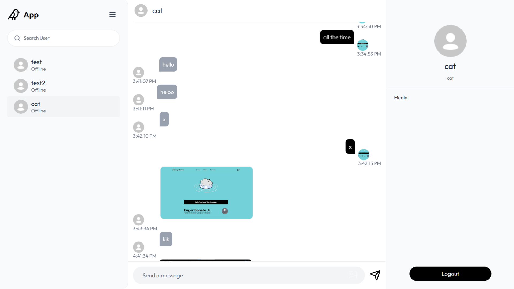
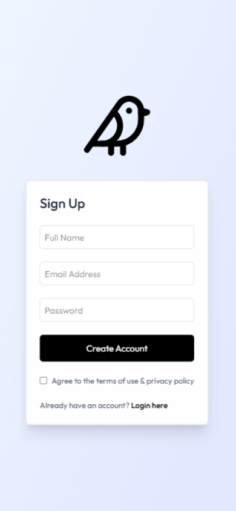

# ChatApp

Full-stack chat application built with **React (Vite) + Node.js + Express + MongoDB + Socket.io**.

## ✨ Features

🔐 User Authentication - Login & Register with JWT
👤 Profile Management - Update profile information
💬 Real-time Messaging - Powered by Socket.io
✅ Message Status - Seen/delivered functionality
📷 Image Upload - Share images via Cloudinary
📱 Responsive Design - Works on desktop and mobile

## 📱 Screenshots

<div align="center">
  <table>
    <tr>
      <td align="center">
        
        <br/>
        <em>Desktop Interface</em>
      </td>
      <td align="center">
        
        <br/>
        <em>Mobile Interface</em>
      </td>
    </tr>
  </table>
</div>

## ⚙️ Setup

### 1. Clone repo & install dependencies

```bash
git clone https://github.com/yourusername/chatapp.git
cd chatapp
```

**Install server:**

```bash
cd server && npm install
```

**Install client:**

```bash
cd client && npm install
```

### 2. Environment Variables

**Server** (`/server/.env`)

```env
PORT=5000

# Cloudinary
CLOUDINARY_CLOUD_NAME=your_cloud_name
CLOUDINARY_API_KEY=your_api_key
CLOUDINARY_SECRET=your_secret

# MongoDB
MONGODB_URI=your_mongodb_uri

# JWT
JWT_SECRET=your_jwt_secret
```

**Client** (`/client/.env`)

```env
VITE_BACKEND_URL=http://localhost:5000
```

## ▶️ Run Locally

**Start the backend:**

```bash
cd server
npm run server
```

Server → http://localhost:5000

**Start the frontend:**

```bash
cd client
npm run dev
```

Client → http://localhost:5173

## 🚀 Deploy to Vercel

**Server** (`/server/vercel.json`)

```json
{
  "version": 2,
  "builds": [{ "src": "server.js", "use": "@vercel/node" }],
  "routes": [{ "src": "/(.*)", "dest": "server.js" }]
}
```

**Client** (`/client/vercel.json`)

```json
{
  "rewrites": [{ "source": "/(.*)", "destination": "/" }]
}
```

**Deploy each with:**

```bash
vercel deploy
```

Ready to chat! 💬
